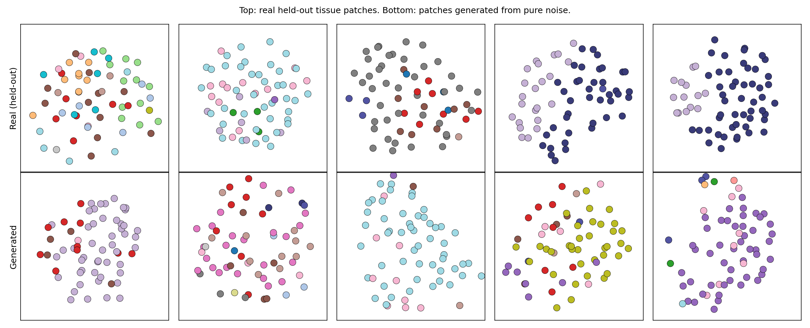
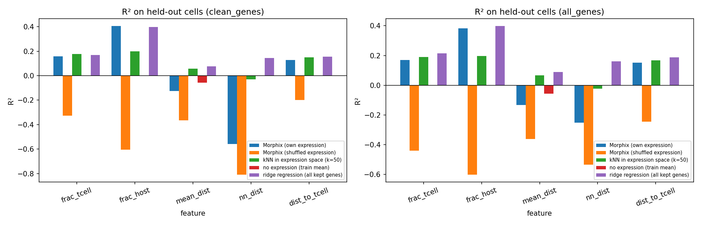
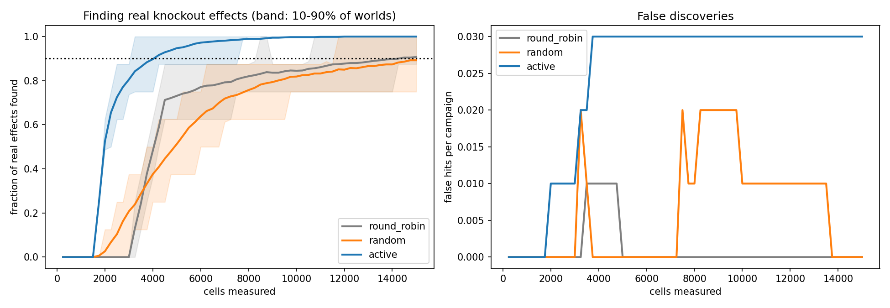
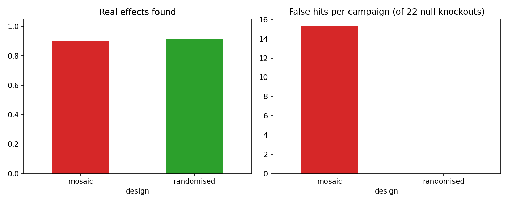

# BlackPearl Morphix

**Generative models of tissue neighbourhoods from spatial single-cell data, and what they can and cannot learn about genetic perturbations.**

Aditya Raj (School of Informatics, University of Edinburgh) · Senthuran Srimurugan (School of Informatics, University of Edinburgh)

> Research prototype. Hypothesis-generation tool only: no clinical or diagnostic use.

---

## In one paragraph

Morphix treats a small piece of tissue as an unordered set of cells (2D positions + cell types) and learns to generate realistic tissue neighbourhoods with **conditional flow matching** and a **permutation-equivariant, distance-aware transformer**. We use it to ask three questions on public spatial data: can it learn tissue organisation (yes), can it predict how a CRISPR gene knockout changes a cell's neighbourhood from an existing pooled screen (no, and we show why), and can a cell's own gene expression predict its neighbourhood (yes, after guarding against signal leaking from neighbouring cells). Finally, a simulated laboratory built on real tumour tissue shows that **randomised experimental layouts plus active experiment selection** find knockout effects with several-fold fewer cells, which motivates a closed-loop, robot-executed lab.

## Results at a glance

| Stage | Question | Result |
|---|---|---|
| **1** | Can it learn tissue organisation? (mouse embryo seqFISH, 19,416 cells) | ✅ Closes **87 ± 8%** of the random-to-real gap in cell-type neighbourhood structure on held-out tissue (3 splits); beats a composition-matched shuffled baseline in every split. An explicit physics (overlap) prior gave no benefit. |
| **2** | Can it predict knockout-specific neighbourhoods? (Perturb-FISH tumour screen, 187,215 cells, 35 knockouts) | ❌ A location-controlled test finds real effects (14 tests across 7 knockouts significant, e.g. NFKBIA cells sit further from T cells), but neither the model nor a simple lookup predicts them in held-out tissue better than assuming no effect. Effects are small, patchy and confounded with location. |
| **2b** | Does a cell's own expression predict its neighbourhood? | ✅ Spearman ρ = **0.57** (host fraction) and **0.41** (T-cell fraction) on held-out tissue; shuffled-expression control ρ ≈ 0; leaky neighbour genes removed. Recovers known biology: interferon-response genes (CXCL10/11, IDO1) near T cells, hypoxia genes (VEGFA, CA9, PDK1) away from them. *One split so far.* |
| **3** | How should experiments be designed? (simulated lab on real tumour tissue, planted effects) | ✅ Neighbourhoods are spatially correlated (a 50-cell patch varies **~5×** more than 50 random cells), so a mosaic/clonal layout gives **15 false hits out of 22 null knockouts** vs **0** with randomised layouts. With randomised layouts, active selection finds 80% of effects with **2.3× fewer cells** (3,250 vs 7,500) and 90% of effects in every simulated world within 4,500 cells. |

Full details, numbers and limitations: [`paper/main.tex`](paper/main.tex) (IEEEtran; compile on Overleaf).

## Figures

| | |
|---|---|
|  |  |
| *Stage 1: real held-out patches (top) vs generated (bottom)* | *Stage 2b: predicting held-out neighbourhoods from expression* |
|  |  |
| *Stage 3: active vs standard screening* | *Stage 3: mosaic vs randomised layouts* |

## How to run

Every stage is a self-contained Google Colab notebook. Open it in Colab, choose the runtime, and click **Runtime → Run all**.

| Notebook | What it does | Runtime | Input |
|---|---|---|---|
| `01_stage1_flow_matching.ipynb` | Train and evaluate the unconditional model on seqFISH | T4 GPU, ~25 min | downloads automatically |
| `02a_explore_perturbfish.ipynb` | Inspect the raw Perturb-FISH tables | CPU, ~3 min | downloads automatically* |
| `02b_link_perturbfish.ipynb` | Link positions, cell classes and knockouts → `morphix_pfish_cells.csv.gz` | CPU, ~5 min | downloads automatically* |
| `02c_knockout_signal_check.ipynb` | Location-controlled permutation test of knockout effects | CPU, ~5 min | `morphix_pfish_cells.csv.gz` |
| `02d_knockout_conditional_model.ipynb` | Knockout-conditioned model + raw and location-matched evaluation | T4 GPU, ~25 min | `morphix_pfish_cells.csv.gz` |
| `02e_expression_to_neighbourhood.ipynb` | Expression-conditioned model, leakage guard, baselines | T4 GPU, ~30 min | `morphix_pfish_cells.csv.gz` + downloads* |
| `03_active_learning_lab.ipynb` | Simulated closed-loop lab: strategies and layouts | CPU, ~5 min | `morphix_pfish_cells.csv.gz` |

\* **Data availability note:** the Perturb-FISH tables are hosted by the [Brain Image Library](https://www.brainimagelibrary.org/), which suspended data downloads during its October 2026 data-centre move. Notebooks 02a, 02b and 02e need that server; 02c, 02d and 03 only need `morphix_pfish_cells.csv.gz` produced by 02b. Once you have downloaded the tables, keep your own copy.

## Repository layout

```
notebooks/   runnable Colab notebooks, in order (01 → 03)
src/         the same code as plain Python modules, for reading
  stage1/    data patches, flow-matching model, metrics
  stage2/    Perturb-FISH patches, conditional models, evaluation
  stage3/    virtual laboratory and experiment-selection strategies
paper/       LaTeX source of the write-up (IEEEtran)
docs/figures result figures used in this README
```

## Evaluation principles

- **Spatially disjoint splits:** whole tissue blocks are held out; test neighbourhoods never share cells with training ones.
- **Baselines everywhere:** random scatter, shuffled cell types, no-effect, lookup, kNN and ridge regression.
- **Pre-specified tests** for Stages 2 and 2b, decided before running.
- **Location control:** knockouts are compared with Control cells from the same tissue block.
- **Leakage guard** (Stage 2b): genes enriched >2× in T cells or host cells are removed from the input.
- **Honest negatives:** the Stage 2 null result, the physics prior's lack of benefit, and a first active-learning strategy that did not beat round robin are all reported.

## Limitations

2D neighbourhoods of 64 cells; one tissue section per dataset; coarse neighbour classes in Stages 2–3; Stage 2 and 2b each use one split so far; Stage 2b associations are not causal; Stage 3 is semi-synthetic (real cells, planted additive effects) and validates experiment-selection logic, not biology. See the paper for the full list.

## Data and acknowledgements

- **seqFISH mouse embryo:** Lohoff *et al.*, *Nature Biotechnology* 40, 74–85 (2022), accessed via [Squidpy](https://squidpy.readthedocs.io/) (Palla *et al.*, *Nature Methods* 19, 171–178, 2022).
- **Perturb-FISH tumour xenograft:** Binan *et al.*, "Simultaneous CRISPR screening and spatial transcriptomics reveal intracellular, intercellular, and functional transcriptional circuits", *Cell* (2025); data via the Brain Image Library, linked from the [SSPsyGene data page](https://sspsygene.ucsc.edu/data).

We thank the authors of both studies for making their data public. Compute: Google Colab.

## Citation

```bibtex
@misc{raj2026morphix,
  title  = {BlackPearl Morphix: Generative Models of Tissue Neighbourhoods from Spatial Single-Cell Data,
            and What They Can and Cannot Learn About Genetic Perturbations},
  author = {Raj, Aditya and Srimurugan, Senthuran},
  year   = {2026},
  note   = {Research draft},
  url    = {https://github.com/<your-username>/BlackPearl-Morphix}
}
```

## License

Code: MIT (see [`LICENSE`](LICENSE)). Datasets remain under the terms of their original publications.
